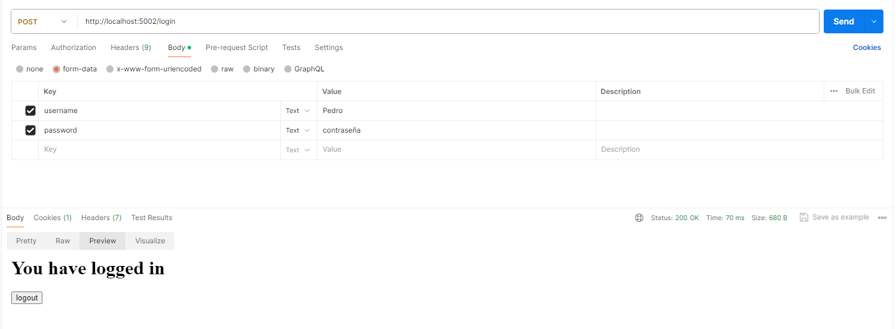

# TC1 Docker Rest API

# Gestor de Tareas con Flask y PostgreSQL

Este proyecto es una aplicación web para la gestión de tareas. Utiliza Flask como framework de backend y PostgreSQL para la gestión de la base de datos.

## Características

- Autenticación de usuarios.
- Creación, actualización y eliminación de tareas.
- Visualización de tareas por usuario y por ID de tarea.

[Link del Api](http://localhost:5002)

# Commandos 

## Construye la imagen de docker

``` bash
docker build -t flask-restapi .
```

## Corre el contenedor de docker
``` bash
docker-compose -f docker-compose.dev.yml up --build
```
## Inicio de sesión usando postman
Se configura un post y en el body se elige la opción de form-data junto con los keys de usenamme y password
``` bash
http://localhost:5002/login
```


# Uso de los endpoint
Uso de los endopoints en postman:
## Crear Tarea
Configurando el metodo POST en postman
``` bash
http://localhost:5002/api/tasks
```
Con un body de ejemplo:
``` bash
{
"name": "Ejemplo Crear",
"description": "Ejemplo de creacion de tarea",
"due_date": "2/3/2024", 
"Idestado":1,
 "Idusuario":1
}
```
## Listar Tareas
Configurando el metodo GET en postman y con el link:
``` bash
http://localhost:5002/api/tasks
```

## Detalles de Tarea
Configurando el metodo GET en postman y con el link de ejemplo para la tarea con id 1:
``` bash
http://localhost:5002/api/tasks/1
```

## Actualizar Tarea:
Configurando el metodo PUT en postman y con el link de ejemplo para modificar la tarea:
``` bash
http://localhost:5002/api/tasks
```
Utilizando el siguiente Body de ejemplo para la tarea 2
``` bash
{
"task_id": 2,
"name": "Ejemplo Modificar",
"description": "Ejemplo de modificación de tarea",
"due_date": "2/3/2024", 
"estado":1,
"usuario":1
}
```

## Eliminar Tarea
Configurando el metodo DELETE en postman y con el link de ejemplo para la tarea con id 1:
``` bash
http://localhost:5002/api/tasks/1
```